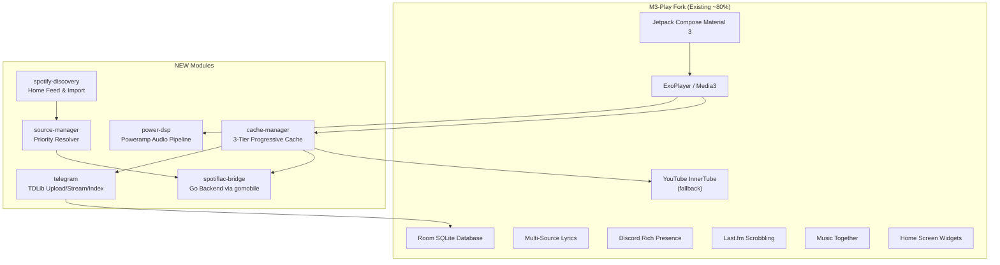

# ☁️ CloudTune — Implementation Plan v2

> **A Poweramp-grade lossless music player with multi-source streaming, Spotify discovery, and Telegram cloud storage.**

---

## 🎯 Vision Summary

CloudTune is an **Android-only Kotlin/Jetpack Compose** music application that:

1. **Discovers** music via Spotify's home feed & playlists (YouTube Music as fallback)
2. **Streams/downloads lossless audio** (FLAC) from the best available source via configurable cascade
3. **Plays** with Poweramp-grade DSP (hardware EQ, bass boost, virtualizer, ReplayGain, gapless, hi-res)
4. **Auto-uploads** songs to a private Telegram channel as permanent cloud storage
5. **Streams back** from Telegram on subsequent plays (3-tier cache: local → Telegram → source)

---

## 📐 Architecture Decisions Record

| Decision | Choice |
|---|---|
| **App Name** | CloudTune |
| **Platform** | Android only (Kotlin + Jetpack Compose) |
| **Base codebase** | Fork M3-Play |
| **Lossless engine** | SpotiFLAC Go backend via gomobile AAR |
| **Telegram API** | TDLib (td-android Kotlin bindings) |
| **Telegram storage** | One private channel + Room SQLite index |
| **Audio format** | Upload FLAC as-is to Telegram |
| **Cache hierarchy** | Local disk → Telegram CDN → Source (default, configurable) |
| **Upload behavior** | Auto-upload all (default), configurable: auto-liked-only, manual-only |
| **Source priority** | Configurable cascade with per-source toggle on/off |
| **YouTube Music** | Disabled by default, toggled on in settings as fallback |
| **Audio playback** | Poweramp-grade DSP pipeline on ExoPlayer |
| **Auth model** | One-time WebView login + manual paste, stored encrypted |
| **Legal** | User disclaimer: "who uses the app owns the responsibility" |

---

## 🔄 Detailed User Flows (All 15)

### FLOW 1: First Launch / Onboarding


**Details:**
- Tutorial: 3 swipeable slides explaining the core value proposition
- Telegram login: Full TDLib auth flow (phone → SMS/call code → optional 2FA password)
- Source setup: Checkboxes to enable sources + drag-to-reorder priority + WebView one-time auth for each enabled source
- Spotify login: **Required** at first launch (drives home feed + metadata discovery)
- User configures: default search mode, default play behavior, upload behavior
- All these settings can be changed later in Settings

---

### FLOW 2: Home Screen

```mermaid
graph TD
    H["Home Tab"] --> Check{"Spotify<br/>logged in?"}
    Check -->|Yes| SF["Spotify Personalized Feed"]
    Check -->|No| YT["YouTube Music Trending/Charts"]

    SF --> SF1["Daily Mix 1-6"]
    SF --> SF2["Discover Weekly"]
    SF --> SF3["Release Radar"]
    SF --> SF4["Your Top Mixes"]
    SF --> SF5["Recently Played"]
    SF --> SF6["New Releases"]

    YT --> YT1["Trending"]
    YT --> YT2["Charts"]
    YT --> YT3["Moods & Genres"]
    YT --> YT4["New Albums"]

    style H fill:#1a1a2e,stroke:#e94560
    style SF fill:#1db954,stroke:#fff,color:#000
    style YT fill:#ff0000,stroke:#fff,color:#fff
```



**Details:**
- **Primary**: M3-Play style carousel layout powered by Spotify's personalized library
- **Fallback**: If Spotify not logged in → YouTube Music trending/charts from InnerTube
- Spotify library sections: playlists, liked songs, followed artists, saved albums
- Each carousel item shows: cover art, title, source badge, quality indicator

---

### FLOW 3: Search (Fully Configurable)

```mermaid
graph TD
    S["Search Bar"] --> Mode{"User's chosen<br/>search mode<br/>(from settings)"}

    Mode -->|"Mode A"| A["Search Spotify catalog<br/>→ show with source badges"]
    Mode -->|"Mode B"| B["Search ALL enabled sources<br/>in parallel → merge & dedup"]
    Mode -->|"Mode C"| C["Spotify metadata first<br/>→ show lossless availability"]
    Mode -->|"Mode D"| D["Source selector dropdown<br/>→ search specific source"]

    A --> R["Unified Results List"]
    B --> R
    C --> R
    D --> R

    R --> R1["Track: Title - Artist"]
    R1 --> Badge["Quality Badges:<br/>🟢 FLAC 24/96<br/>🔵 FLAC 16/44<br/>🟡 320kbps<br/>⚪ 128kbps"]
    R1 --> SourceIcon["Source Icons:<br/>Deezer / Tidal / Qobuz<br/>/ Amazon / SoundCloud / YT"]

    style S fill:#1a1a2e,stroke:#e94560
    style R fill:#0f3460,stroke:#16c79a
```



**Details:**
- **4 search modes**, user picks default during onboarding + can change in settings
- Mode selector also accessible as a dropdown/chip in the search bar itself
- Results show quality badges + source availability icons
- Long-press a result → see all available sources for that track

---

### FLOW 4: Play a Song (Fully Configurable)

```mermaid
graph TD
    Tap["User taps track"] --> Mode{"User's chosen<br/>play behavior<br/>(from settings)"}

    Mode -->|"Auto-silent"| A1["Resolve best source<br/>silently → play immediately"]
    Mode -->|"Auto-toast"| A2["Resolve best source<br/>→ toast 'Playing FLAC from Deezer'<br/>→ play"]
    Mode -->|"Manual picker"| A3["Show source picker<br/>bottom sheet<br/>→ user picks → play"]
    Mode -->|"Auto + badge"| A4["Auto-resolve<br/>→ show quality badge<br/>on player<br/>→ tap badge to switch"]

    A1 --> Play["ExoPlayer Streams"]
    A2 --> Play
    A3 --> Play
    A4 --> Play

    Play --> DSP["Power DSP Pipeline<br/>EQ + Bass + ReplayGain"]
    DSP --> Cache["Auto-cache locally"]
    Cache --> Upload{"Upload setting?"}
    Upload -->|Auto-all| TG1["Upload FLAC to Telegram<br/>(background)"]
    Upload -->|Auto-liked| TG2["Upload only if liked ❤️"]
    Upload -->|Manual| TG3["No auto-upload"]

    TG1 --> Index["Update Room SQLite index"]
    TG2 --> Index

    style Tap fill:#1a1a2e,stroke:#e94560
    style Play fill:#0f3460,stroke:#16c79a
    style TG1 fill:#0088cc,stroke:#fff,color:#fff
```



**Details:**
- **4 play behaviors**, configurable in settings + onboarding
- On next play of same track: local cache → Telegram stream → source (3-tier)
- After streaming completes, FLAC is auto-uploaded to Telegram (based on upload setting)
- Upload is always lossless FLAC regardless of streaming quality
- Quality badge on player screen always visible (tap to switch source live)

---

### FLOW 5: Upload to Telegram

```mermaid
graph TD
    Trigger{"Upload trigger"} -->|"Auto (default)"| Auto["Every streamed/downloaded<br/>song auto-uploads in background"]
    Trigger -->|"Liked only"| Liked["Upload only when<br/>user taps ❤️"]
    Trigger -->|"Manual"| Manual["No auto-upload<br/>User explicitly saves"]

    Auto --> BG["Background WorkManager"]
    Liked --> BG
    Manual --> Explicit["User taps 'Save to Cloud'<br/>button on track"]
    Explicit --> BG

    BG --> Tag["Tag FLAC with metadata<br/>(SpotiFLAC Go tagger)"]
    Tag --> TDLib["TDLib uploads to<br/>private Telegram channel"]
    TDLib --> Caption["Caption: JSON metadata<br/>{title, artist, album,<br/>isrc, duration, bitrate}"]
    Caption --> Index["Room SQLite index<br/>message_id → metadata"]
    Index --> Done["✅ Cloud backed up"]

    style Trigger fill:#1a1a2e,stroke:#e94560
    style Done fill:#16c79a,stroke:#fff
```



**Details:**
- Upload behavior configurable during onboarding + settings
- Default: auto-upload everything (silent background, no interruptions)
- WorkManager ensures reliability (retry on failure, respects battery/network constraints)
- Progress visible in Cloud tab (upload queue section)
- FLAC tagged with full metadata before upload using SpotiFLAC's Go tagger

---

### FLOW 6: Cloud Library (Telegram-backed tracks)

**Three access methods (user configures preference):**

| Method | Description |
|---|---|
| **Separate Cloud tab** | Dedicated sub-tab inside Library: `Local Songs \| Cloud Songs \| Playlists \| Albums \| Artists` |
| **Toggle inside Library** | Library tab has a toggle switch: Local ↔ Cloud |
| **Badge overlay** | Cloud-backed tracks show ☁️ badge in main library — no separate view |

- Default: **Sub-tab inside Library** (see Flow 13)
- Cloud library is searchable, filterable (by artist, album, format, date uploaded)
- Shows upload queue status at top (X pending, Y uploading, Z failed)

---

### FLOW 7: Navigation Structure

```
┌─────────────────────────────────────────────┐
│                                             │
│  ┌─────────┐  ┌──────────┐  ┌───────────┐  │
│  │  Home   │  │  Search  │  │  Library  │  │
│  │  🏠     │  │  🔍      │  │  📚       │  │
│  └─────────┘  └──────────┘  └───────────┘  │
│           3-Tab Bottom Navigation           │
│                                             │
│  ┌──────────────────────────────────────┐   │
│  │ Profile/Hamburger → Settings         │   │
│  │   ├── Account (Telegram, Spotify)    │   │
│  │   ├── Sources (priority, auth)       │   │
│  │   ├── Playback (behavior, quality)   │   │
│  │   ├── Cloud (upload, cache mode)     │   │
│  │   ├── DSP (EQ, bass, virtualizer)    │   │
│  │   ├── Appearance (theme, layout)     │   │
│  │   ├── Integration (Discord, Last.fm) │   │
│  │   ├── Privacy & Disclaimer           │   │
│  │   └── About                          │   │
│  └──────────────────────────────────────┘   │
│                                             │
│  ┌──────────────────────────────────────┐   │
│  │ Mini Player Bar (persistent bottom)  │   │
│  │ ▶ Track Title - Artist    ❤️ ⏭️      │   │
│  │ Swipe up → Full Screen Player        │   │
│  └──────────────────────────────────────┘   │
└─────────────────────────────────────────────┘
```

---

### FLOW 8: Now Playing / Player Screen

```
┌─────────────────────────────────┐
│  Swipe down to minimize         │
│                                 │
│  ┌───────────────────────────┐  │
│  │                           │  │
│  │    ┌─────────────────┐    │  │
│  │    │                 │    │  │
│  │    │   Album Art     │    │  │
│  │    │   (large)       │    │  │
│  │    │                 │    │  │
│  │    └─────────────────┘    │  │
│  │                           │  │
│  │  Track Title              │  │
│  │  Artist Name              │  │
│  │  [FLAC 24/96 🟢] [Deezer] │  │  ← tap badge to switch source
│  │                           │  │
│  │  ━━━━━━━━●━━━━━━━━━━━━━━  │  │  ← progress bar
│  │  1:24         -2:36       │  │
│  │                           │  │
│  │    ↻    ⏮   ▶   ⏭    ⤮   │  │  ← controls
│  │                           │  │
│  │  🎵 Lyrics  📋 Queue  ☁️  │  │  ← bottom actions
│  └───────────────────────────┘  │
│                                 │
│  Swipe left → skip              │
│  Swipe right → previous         │  ← configurable gestures
│  Swipe down → minimize          │
└─────────────────────────────────┘
```

**Player modes (configurable in settings):**
- **Mode A**: Mini player bar + full-screen on swipe up (like M3-Play)
- **Mode B**: Floating mini player + full-screen with gesture controls (swipe left/right/down)
- Default: **Mode A** (M3-Play style), Mode B toggleable

---

### FLOW 9: Settings

```
Settings (with search bar at top)
├── 🔑 Account
│   ├── Telegram (login status, channel info)
│   ├── Spotify (login/logout, sync status)
│   ├── Discord (Rich Presence toggle)
│   └── Last.fm / ListenBrainz (scrobbling)
├── 🎵 Sources
│   ├── Priority order (drag to reorder)
│   ├── Per-source toggle (on/off)
│   ├── Per-source auth (WebView / manual paste)
│   └── YouTube Music fallback toggle
├── ▶️ Playback
│   ├── Default play behavior (4 modes)
│   ├── Default search mode (4 modes)
│   ├── Audio quality preference
│   ├── Crossfade duration
│   ├── Gapless playback toggle
│   └── Audio normalization
├── ☁️ Cloud
│   ├── Upload behavior (auto-all / auto-liked / manual)
│   ├── Cache mode (local-first / telegram-first / source-first)
│   ├── Cache size limit
│   ├── Telegram channel management
│   └── Re-sync cloud index
├── 🎛️ DSP
│   ├── 10-band Parametric EQ (visual curve)
│   ├── Bass Boost (crossover freq slider)
│   ├── Virtualizer (spatial width)
│   ├── Loudness Enhancer
│   ├── ReplayGain mode (track / album / off)
│   └── Presets (save / load / share)
├── 🎨 Appearance
│   ├── Theme (Material You / custom palette)
│   ├── Player layout (mode A / mode B)
│   ├── Library view (cloud tab mode)
│   └── Dark mode / AMOLED
├── 🔒 Privacy & Disclaimer
│   ├── "User owns responsibility" disclaimer
│   └── Data usage transparency
└── ℹ️ About
    ├── Version, changelog
    ├── Year-in-Music stats
    └── Licenses
```

---

### FLOW 10: Source Authentication

```mermaid
graph TD
    Setup["Source Setup<br/>(onboarding or settings)"] --> List["Source List<br/>with toggle switches"]

    List --> Enable["User enables a source"]
    Enable --> Check{"Auth type?"}

    Check -->|"WebView supported<br/>(Spotify, Deezer)"| WV["Open WebView<br/>→ User logs in normally<br/>→ Auto-extract token/cookie"]
    Check -->|"Manual only<br/>(Tidal, Qobuz)"| Manual["Show text field<br/>+ 'How to get token' link<br/>→ User pastes token"]

    WV --> Save["Encrypt & save<br/>to DataStore"]
    Manual --> Save
    Save --> Done["✅ Source authenticated<br/>Badge: 'Connected'"]

    Done --> Expire{"Token expires?"}
    Expire -->|Yes| Notify["Show notification<br/>'Deezer session expired'<br/>→ tap to re-auth"]
    Expire -->|No| Active["Source active<br/>in cascade"]

    style Setup fill:#1a1a2e,stroke:#e94560
    style Done fill:#16c79a,stroke:#fff
```



**Details:**
- One-time auth during first setup → stored encrypted → never asked again
- WebView login for Spotify, Deezer (auto-extracts ARL cookie / OAuth token)
- Manual paste for Tidal (session token), Qobuz (app_id + user_auth_token)
- Token expiry detection → notification to re-auth
- Settings screen shows per-source status: Connected ✅ / Expired ⚠️ / Not configured ❌

---

### FLOW 11: Download (Playlist-Level)

```mermaid
graph TD
    PL["Playlist / Album Screen"] --> DL["Download Button ⬇️"]
    DL --> Options["Bottom Sheet Options"]
    Options --> O1["Download All (FLAC)"]
    Options --> O2["Download All (320kbps)"]
    Options --> O3["Download All (128kbps)"]
    Options --> O4["Download Selected Tracks"]

    O1 --> Resolve["Resolve each track<br/>from best source"]
    O2 --> Resolve
    O3 --> Resolve
    O4 --> Select["User selects tracks<br/>with checkboxes"]
    Select --> Resolve

    Resolve --> Queue["Add to download queue"]
    Queue --> Worker["WorkManager workers<br/>(parallel, max 3)"]
    Worker --> Tag["Tag with metadata<br/>(Go tagger)"]
    Tag --> Save["Save to local storage"]
    Save --> Upload{"Upload setting?"}
    Upload -->|Auto| TG["Upload to Telegram"]
    Upload -->|Manual| Skip["Skip upload"]

    style PL fill:#1a1a2e,stroke:#e94560
    style TG fill:#0088cc,stroke:#fff,color:#fff
```



**Details:**
- **No per-track download button** — streaming auto-caches everything
- **Playlist/album-level download** button with SpotiFLAC-style options (quality, select tracks)
- Download queue visible in notification + Library tab
- Downloaded tracks auto-upload to Telegram based on upload setting

---

### FLOW 12: Offline Mode (Automatic)

```mermaid
graph TD
    Net["Network State<br/>Monitor"] --> Check{"Internet<br/>available?"}

    Check -->|Online| Online["Normal operation:<br/>Stream → Cache → Upload"]
    Check -->|Offline| Offline["Automatic offline mode"]

    Offline --> Filter["Show only available tracks:<br/>• Locally cached songs<br/>• Telegram-cached songs<br/>• Downloaded songs"]
    Filter --> Badge["Offline badge 📡❌<br/>on status bar"]
    Badge --> Play["Play from local cache"]

    Online --> Resume["Resume normal:<br/>• Pending uploads resume<br/>• New streams available<br/>• Cache sync continues"]

    style Net fill:#1a1a2e,stroke:#e94560
    style Offline fill:#ff6b35,stroke:#fff,color:#fff
    style Online fill:#16c79a,stroke:#fff
```



---

### FLOW 13: Library Organization

```
Library Tab
├── 🎵 Local Songs     ← downloaded/cached on device
├── ☁️ Cloud Songs     ← Telegram-backed tracks (with upload queue)
├── 📋 Playlists       ← user playlists + imported Spotify playlists
├── 💿 Albums          ← albums from local + cloud combined
└── 🎤 Artists         ← artists from local + cloud combined

Each track shows:
  📱 = local only
  ☁️ = cloud only (Telegram)
  📱☁️ = both local and cloud
  🟢 FLAC 24/96 | 🔵 FLAC 16/44 | 🟡 320k = quality badge
  [Deezer] [Tidal] [Qobuz] = source icon
```

---

### FLOW 14: Playlist Import

```mermaid
graph TD
    Import["Import Playlist"] --> Source{"From where?"}
    Source -->|Spotify| SP["Paste Spotify playlist URL<br/>or select from your library"]
    Source -->|YouTube| YT["Paste YouTube playlist URL"]
    Source -->|Manual| URL["Paste any supported URL"]

    SP --> Parse["Parse playlist<br/>(titles, artists, ISRCs)"]
    YT --> Parse
    URL --> Parse

    Parse --> Choose{"Import mode?"}
    Choose -->|"Download All"| Batch["Batch cross-match<br/>→ resolve sources<br/>→ download FLAC<br/>→ upload to Telegram"]
    Choose -->|"Stream On-Demand"| OnDemand["Save playlist metadata only<br/>→ resolve when playing"]

    Batch --> Progress["Progress screen:<br/>Track 14/52 ✅<br/>3 not found ⚠️"]
    OnDemand --> Ready["Playlist saved<br/>to Library"]

    style Import fill:#1a1a2e,stroke:#e94560
    style Ready fill:#16c79a,stroke:#fff
```



---

### FLOW 15: Queue Management

```
Access from:
  1. Player screen → Queue icon button → full-screen queue
  2. Mini player → swipe up → Queue tab
  3. M3-Play style queue management

Queue Features:
  • Currently playing track (highlighted)
  • Up Next list (drag to reorder)
  • Queue history (recently played)
  • Add to queue from any track (long press → "Play Next" / "Add to Queue")
  • Clear queue
  • Save queue as playlist
  • Infinite radio: auto-fetch related tracks when queue ends
```

---

## 🏗 Architecture & Module Structure



---

## 📁 Final Project Structure — Clean Code Reference

> Every file, class, function, and directory below includes: **purpose**, **responsibilities**, **dependencies**, **design rationale**, **edge cases**, and **anti-patterns to avoid**.

---

### 📦 Root: `CloudTune/`

```
CloudTune/
├── app/                   # Main application module
├── innertube/             # YouTube Music InnerTube client (fallback source)
├── kizzy/                 # Discord Gateway WebSocket RPC
├── lastfm/                # Last.fm / ListenBrainz scrobbler
├── lrclib/                # LrcLib synced lyrics client
├── kugou/                 # KuGou lyrics client
├── paxsenix/              # Paxsenix lyrics + translation
├── telegram/              # [NEW] TDLib Telegram cloud layer
├── spotiflac-bridge/      # [NEW] SpotiFLAC Go backend via gomobile
├── source-manager/        # [NEW] Multi-source priority resolver
├── cache-manager/         # [NEW] 3-tier progressive cache system
├── power-dsp/             # [NEW] Poweramp-grade audio DSP pipeline
├── spotify-discovery/     # [NEW] Spotify catalog discovery & import
├── build.gradle.kts       # Root Gradle: version catalogs, shared plugins
├── settings.gradle.kts    # Declares all modules for Gradle resolution
└── gradle.properties      # JVM args, AndroidX opt-ins, Kotlin compiler flags
```

| File | Clean Code Notes |
|---|---|
| `build.gradle.kts` | **SRP**: Only defines shared plugin versions and repositories. No module-specific config here. Use `libs.versions.toml` for version catalog. |
| `settings.gradle.kts` | **Must include** every new module. Forgetting to register a module = unresolved dependency errors at build time. |
| `gradle.properties` | Set `android.useAndroidX=true`, `kotlin.code.style=official`, `org.gradle.parallel=true`, `org.gradle.caching=true`. |

---

### 📦 Module: `app/` — Main Application

> **Forked from M3-Play.** Contains the Android application shell, playback engine, Room database, UI, and ViewModels.

---

#### 📂 `app/src/main/kotlin/com/cloudtune/`

##### `MainActivity.kt`

| Aspect | Detail |
|---|---|
| **Purpose** | Single Activity entry point for the entire Compose-based app. Hosts NavHost. |
| **Responsibilities** | Initialize Hilt DI, set up Material 3 theme, configure edge-to-edge display, handle deep links and share intents. |
| **Key Functions** | `onCreate()` — sets `setContent { CloudTuneTheme { NavHost(...) } }` |
| **Dependencies** | `Theme.kt`, NavHost composables, Hilt `@AndroidEntryPoint` |
| **Edge Cases** | Deep link from Spotify share → must parse URL and route to search/play. Share intent while app is cold-started → ensure DI is ready before parsing. |
| **Anti-Patterns** | ❌ Don't put business logic here. ❌ Don't hold state — delegate to ViewModels. ❌ Don't import playback code directly — use MediaController binding. |

---

#### 📂 `app/.../playback/`

##### `MusicService.kt`

| Aspect | Detail |
|---|---|
| **Purpose** | Foreground media service managing ExoPlayer lifecycle, notification, and audio session. |
| **Responsibilities** | Create ExoPlayer with custom audio pipeline, manage media session, handle audio focus, emit playback events, trigger auto-upload after song completes. |
| **Key Classes** | Extends `MediaLibraryService` (AndroidX Media3) |
| **Key Functions** | |
| `onGetSession()` | Returns the `MediaLibrarySession` for client binding. Keep it stateless — session state lives in ExoPlayer. |
| `createPlayer()` | Builds ExoPlayer with: `CacheDataSource.Factory` (local cache), `TelegramDataSource.Factory`, `ResolvingDataSource` (source resolution), custom `DefaultAudioSink` with DSP chain. **Design**: Use builder pattern, never pass >3 params to any factory. |
| `onPlayerError()` | Handle `PlaybackException`. **Edge cases**: Source CDN 403 → retry with next source. Telegram download timeout → fall back to direct source. Corrupted cache → evict and re-fetch. |
| `onMediaItemTransition()` | Fires when track changes. Triggers: scrobble to Last.fm, update Discord RPC, preload next track lyrics, check if current track needs Telegram upload. |
| **Dependencies** | `ThreeTierCacheResolver`, `PowerAudioProcessor`, `TelegramUploadService`, `DiscordRPC`, `ScrobbleManager` |
| **Concurrency** | Runs on main thread for ExoPlayer callbacks. Use `serviceScope` (SupervisorJob) for background work like upload/scrobble. Never block the player thread. |
| **Anti-Patterns** | ❌ Don't put UI code here. ❌ Don't hold references to Activities (memory leak). ❌ Don't use `GlobalScope` — use service-scoped coroutines. ❌ Don't exceed 500 lines — extract helpers into `MusicServiceHelper.kt`. |

##### `QueueManager.kt`

| Aspect | Detail |
|---|---|
| **Purpose** | Manages play queue state: current index, shuffle seed, repeat mode, infinite radio auto-queue. |
| **Key Functions** | |
| `addToQueue(track, position)` | Insert track at position. **Edge case**: inserting at index 0 while playing → must not restart current track. |
| `shuffleQueue(seed)` | Fisher-Yates shuffle with persistent seed (save to DataStore for session restore). |
| `fetchAutoQueue()` | When queue ends, fetch related tracks via `YouTube.next()` or `SourceResolver.getRelated()`. **Rate limit**: max 1 auto-fetch per 30s to prevent API spam. |
| `persistQueue()` | Serialize queue to Room for crash recovery. Use `@Transaction` to ensure atomicity. |
| **Anti-Patterns** | ❌ Don't mutate queue from UI thread directly — use `Channel` or `MutableStateFlow` with `Mutex`. ❌ Don't store full track metadata in queue — store IDs + resolve lazily. |

##### `AudioSessionManager.kt`

| Aspect | Detail |
|---|---|
| **Purpose** | Manages Android AudioFocus, Bluetooth disconnect handling, and becoming-noisy broadcasts. |
| **Key Functions** | |
| `requestFocus()` | Request `AUDIOFOCUS_GAIN` with `USAGE_MEDIA`. Returns `AUDIOFOCUS_REQUEST_GRANTED` or `DELAYED`. |
| `onAudioFocusChange(focusChange)` | `LOSS_TRANSIENT` → pause + save position. `LOSS_TRANSIENT_CAN_DUCK` → lower volume 50%. `GAIN` → restore. `LOSS` → pause + release. |
| `onBecomingNoisy()` | Headphones unplugged → pause immediately. Register `BroadcastReceiver` for `ACTION_AUDIO_BECOMING_NOISY`. |
| **Edge Cases** | Bluetooth disconnect during playback → `ACTION_ACL_DISCONNECTED` fires before `BECOMING_NOISY` on some OEMs. Handle both. |
| **Anti-Patterns** | ❌ Don't forget to unregister receivers in `onDestroy()`. ❌ Don't request focus before player is ready. |

---

#### 📂 `app/.../db/`

##### `CloudTuneDatabase.kt`

| Aspect | Detail |
|---|---|
| **Purpose** | Room database definition with all entities, DAOs, and migration schemas. |
| **Entities** | `SongEntity`, `AlbumEntity`, `ArtistEntity`, `PlaylistEntity`, `PlaylistSongMap`, `LyricsEntity`, `DownloadEntity`, `HistoryEntity`, `TelegramTrackIndex`, `SourceAuthToken` |
| **Version Strategy** | Increment `version` for every schema change. Write explicit `Migration(N, N+1)` — never use `fallbackToDestructiveMigration()` in production (data loss). |
| **Key Functions** | |
| `songDao()` | CRUD for tracks. Queries: `getByIsrc(isrc)`, `getByTelegramMessageId(msgId)`, `searchByTitle(query)`, `getOfflineAvailable()`. |
| `telegramIndexDao()` | Maps Telegram `messageId` → track metadata. Queries: `findByIsrc(isrc)`, `getAllUploaded()`, `getPendingUploads()`, `getUploadStats()`. |
| **Clean Code** | Each DAO is a single `@Dao` interface. Max 10 queries per DAO — split by entity. Use `@Transaction` for multi-table writes. Return `Flow<List<T>>` for reactive UI, `suspend fun` for one-shot operations. |
| **Anti-Patterns** | ❌ Never run Room queries on main thread. ❌ Don't use raw SQL strings — use `@Query` with parameter binding. ❌ Don't store binary blobs (album art) in Room — store file paths. |

##### `Entities.kt` (or split per entity)

| Entity | Fields | Notes |
|---|---|---|
| `SongEntity` | `id: String` (YouTube/source ID), `title`, `artist`, `album`, `duration`, `isrc`, `format`, `bitrate`, `localPath?`, `telegramMessageId?`, `sourceId`, `playCount`, `likedAt?`, `createdAt` | **ISRC is the universal cross-match key.** Nullable `localPath` and `telegramMessageId` indicate storage state. |
| `TelegramTrackIndex` | `messageId: Long` (PK), `fileId: Int`, `fileSize: Long`, `title`, `artist`, `album`, `isrc?`, `duration`, `format`, `bitrate`, `uploadedAt`, `lastPlayedAt?`, `playCount` | Separate from `SongEntity` — TG index is the cloud state mirror. Joined via `isrc` or `songId` FK. |
| `SourceAuthToken` | `sourceId: String` (PK), `tokenType` (OAUTH/ARL/SESSION), `encryptedToken: String`, `expiresAt: Long?`, `createdAt` | Encrypted with AndroidKeyStore-backed `EncryptedSharedPreferences` or `Tink`. **Never store raw tokens.** |
| `DownloadEntity` | `id: Long` (auto), `songId`, `status` (PENDING/DOWNLOADING/TAGGING/UPLOADING/DONE/FAILED), `progress: Float`, `filePath?`, `error?`, `createdAt` | Tracks download + upload pipeline state. `status` is an enum — use sealed class for type safety. |

---

#### 📂 `app/.../ui/screens/`

##### `onboarding/OnboardingScreen.kt`

| Aspect | Detail |
|---|---|
| **Purpose** | First-launch wizard: Tutorial → Telegram Login → Source Setup → Spotify Login → Config → Home |
| **Key Composables** | |
| `TutorialPager()` | `HorizontalPager` with 3 slides. Each slide: illustration + title + subtitle. Use `AnimatedVisibility` for enter animations. Store "onboarding_complete" flag in DataStore. |
| `TelegramLoginStep()` | Phone input → code input → optional 2FA. Observe `TelegramAuthManager.authState: StateFlow<AuthState>`. Handle: invalid phone format, wrong code (3 attempts), 2FA required, flood wait (429). |
| `SourceSetupStep()` | Checklist of sources with toggle switches + drag handle for priority reorder. Use `LazyColumn` with `rememberReorderableLazyListState()`. On enable → trigger WebView auth or manual paste dialog. |
| `ConfigStep()` | Radio groups for: search mode (4 options), play behavior (4 options), upload behavior (3 options). Save to DataStore. |
| **Anti-Patterns** | ❌ Don't skip tutorial check — always verify `onboarding_complete` in `MainActivity`. ❌ Don't block the UI during Telegram auth — show loading spinner. ❌ Don't hardcode slide content — use string resources for i18n. |

##### `home/HomeScreen.kt`

| Aspect | Detail |
|---|---|
| **Purpose** | Main landing screen with Spotify personalized feed or YouTube Music fallback. |
| **Key Composables** | |
| `HomeContent(state: HomeUiState)` | `LazyColumn` of carousel sections. Each section: `Text` header + `LazyRow` of track/album/playlist cards. Pull-to-refresh with `pullRefresh()` modifier. |
| `CarouselSection(title, items)` | Horizontal scrolling row. Each item: 120dp card with cover art (`AsyncImage` via Coil), title, artist. Tap → play or navigate. Long press → context menu (Play Next, Add to Queue, Save to Cloud). |
| **State** | `HomeViewModel` exposes `StateFlow<HomeUiState>` with `sealed class`: `Loading`, `Success(sections)`, `Error(message)`. |
| **Edge Cases** | Empty home feed (new Spotify account) → show "Explore" fallback with trending charts. Network error → show cached last-known feed + error snackbar. |
| **Anti-Patterns** | ❌ Don't fetch data in Composable — use `LaunchedEffect` in ViewModel init. ❌ Don't use `remember { mutableStateOf() }` for server data — use ViewModel StateFlow. |

##### `search/SearchScreen.kt`

| Aspect | Detail |
|---|---|
| **Purpose** | Multi-mode search with configurable behavior. |
| **Key Composables** | |
| `SearchBar(query, onSearch, searchMode)` | `TextField` with search icon + mode selector chip/dropdown. Debounce input by 300ms before triggering search. Show suggestions while typing (from `YouTube.searchSuggestions()`). |
| `SearchResults(results, searchMode)` | `LazyColumn` of `TrackResultItem` composables. Each shows: cover art, title, artist, quality badge (`QualityBadge`), source icon (`SourceIcon`). |
| `SourceSelector()` | Dropdown or chip group: "All Sources", "Spotify", "Deezer", "Tidal", etc. Only shows enabled sources. |
| `QualityBadge(format, bitrate, sampleRate)` | Colored chip: 🟢 FLAC 24/96, 🔵 FLAC 16/44, 🟡 320k, ⚪ 128k. Use `when` expression, not if-else chain. |
| **Anti-Patterns** | ❌ Don't search on every keystroke — debounce. ❌ Don't block UI during parallel source search — show progressive results. ❌ Don't forget to cancel previous search coroutine when new query arrives. |

##### `player/PlayerScreen.kt`

| Aspect | Detail |
|---|---|
| **Purpose** | Full-screen now-playing screen with album art, controls, lyrics, quality info. |
| **Key Composables** | |
| `FullPlayerSheet()` | `BottomSheetScaffold` or `ModalBottomSheet` expanding from mini player. Swipe down → minimize. |
| `AlbumArtwork(url)` | Large `AsyncImage` with Material 3 dynamic palette extraction. Extract dominant colors via `Palette` → feed to `PlayerBackgroundColorUtils`. |
| `PlaybackControls(isPlaying, onPlayPause, onNext, onPrev)` | Row of icon buttons. Use `AnimatedContent` for play↔pause icon transition. |
| `ProgressBar(position, duration, onSeek)` | Custom `Slider` with buffered position indicator. Update every 100ms via `Player.currentPosition` polling (not faster — battery drain). |
| `QualitySourceBadge(format, source)` | Tappable chip showing current quality + source. Tap → `SourcePickerBottomSheet` to switch source mid-playback. |
| `LyricsOverlay(lyrics, currentPosition)` | Scrollable synced lyrics with auto-scroll to current line + highlight animation. |
| **Gestures** | Swipe left → next track. Swipe right → previous. Configurable in settings (can be disabled). Use `detectHorizontalDragGestures` with velocity threshold >300dp/s to prevent accidental triggers. |
| **Anti-Patterns** | ❌ Don't re-extract palette on every recomposition — cache with `remember(artworkUrl)`. ❌ Don't poll position faster than 100ms. ❌ Don't put player logic in Composable — delegate to `PlayerViewModel`. |

##### `player/MiniPlayer.kt`

| Aspect | Detail |
|---|---|
| **Purpose** | Persistent bottom bar showing current track with basic controls. |
| **Key Composables** | |
| `MiniPlayerBar(track, isPlaying, progress, onTap, onPlayPause, onNext)` | Fixed-height (64dp) Row: cover art thumbnail (48dp) + title/artist column + play/pause + next. `LinearProgressIndicator` at top edge. Tap → expand to full player. |
| **Anti-Patterns** | ❌ Don't render MiniPlayer when nothing is playing — check `currentTrack != null`. ❌ Don't animate progress bar with `animateFloatAsState` (jittery) — use raw float value. |

##### `library/LibraryScreen.kt`

| Aspect | Detail |
|---|---|
| **Purpose** | Tabbed library view: Local Songs | Cloud Songs | Playlists | Albums | Artists. |
| **Key Composables** | |
| `LibraryTabs()` | `ScrollableTabRow` with 5 tabs. Use `HorizontalPager` for swipeable tab content with `rememberPagerState()`. |
| `LocalSongsTab()` | `LazyColumn` of locally cached/downloaded tracks. Each item shows 📱 badge. Sort options: title, artist, date added, play count. |
| `CloudSongsTab()` | `LazyColumn` of Telegram-indexed tracks. Shows ☁️ badge + upload queue status header. Pull-to-refresh triggers `TelegramSyncManager.resync()`. |
| `PlaylistsTab()` | User-created playlists + imported Spotify playlists. FAB → "Create Playlist" or "Import from Spotify/YouTube". |
| `AlbumsTab()` / `ArtistsTab()` | Grid layout (`LazyVerticalGrid`, 2-3 columns). Combined local + cloud data, deduplicated by album/artist name. |
| `StorageBadge(track)` | Composable showing: 📱 (local), ☁️ (cloud), 📱☁️ (both). Derived from: `track.localPath != null` and `track.telegramMessageId != null`. |
| **Anti-Patterns** | ❌ Don't load all tracks at once — use `PagingSource` with Paging 3 library. ❌ Don't query Room on every tab switch — cache in ViewModel. ❌ Don't forget empty states ("No songs yet — start streaming!"). |

##### `settings/SettingsScreen.kt`

| Aspect | Detail |
|---|---|
| **Purpose** | Searchable settings hub with categorized sub-screens. |
| **Key Composables** | |
| `SettingsSearchBar(query)` | Filters all settings items across all categories. Index all setting titles + descriptions for fast filtering. |
| `SettingsCategory(title, items)` | Group of `SettingsItem` composables. Each item: icon, title, subtitle, trailing widget (switch, dropdown, navigation arrow). |
| **Sub-Screens** (each is a separate file) | |
| `AccountSettings.kt` | Telegram status (connected/disconnected, channel info), Spotify (login/logout), Discord, Last.fm. |
| `SourceSettings.kt` | Drag-to-reorder source priority list. Per-source: toggle on/off + auth status badge (✅ Connected / ⚠️ Expired / ❌ Not configured) + "Re-authenticate" button. |
| `PlaybackSettings.kt` | Default play behavior (4 radio options), search mode (4 radio options), crossfade slider (0-12s), gapless toggle, audio normalization toggle. |
| `CloudSettings.kt` | Upload behavior (3 radio options), cache mode (3 radio options), cache size limit slider (100MB-10GB), "Re-sync cloud index" button, "Clear local cache" with confirmation dialog. |
| `DSPSettings.kt` | Interactive 10-band EQ curve (Canvas-drawn), bass boost slider with crossover freq, virtualizer width slider, ReplayGain mode (track/album/off), preset save/load/share. |
| `AppearanceSettings.kt` | Theme picker (Material You / custom), dark mode (system/on/off), AMOLED black toggle, player layout (mode A/B). |
| `PrivacySettings.kt` | Legal disclaimer text, data usage transparency, clear history button. |
| **Anti-Patterns** | ❌ Don't put setting logic in Composable — read/write via `SettingsViewModel` wrapping `DataStore`. ❌ Don't use `SharedPreferences` — use `DataStore<Preferences>`. ❌ Don't forget to debounce slider values before persisting. |

---

#### 📂 `app/.../viewmodels/`

| ViewModel | Purpose | Key StateFlows | Key Functions | Anti-Patterns |
|---|---|---|---|---|
| `HomeViewModel` | Fetches and caches home feed | `homeState: StateFlow<HomeUiState>` | `refreshFeed()`, `loadSpotifyFeed()`, `loadYouTubeFeed()` | ❌ Don't fetch in `init{}` without checking cached data first |
| `SearchViewModel` | Multi-mode search orchestration | `results: StateFlow<List<SearchResult>>`, `isSearching: StateFlow<Boolean>` | `search(query, mode)`, `cancelSearch()` | ❌ Don't forget to cancel previous search Job |
| `PlayerViewModel` | Player state observation + control | `currentTrack: StateFlow<Track?>`, `playbackState: StateFlow<PlaybackState>`, `progress: StateFlow<Float>` | `play(track)`, `pause()`, `seekTo(ms)`, `switchSource(sourceId)` | ❌ Don't hold ExoPlayer reference — use MediaController |
| `LibraryViewModel` | Local + cloud library queries | `localSongs: Flow<PagingData<Song>>`, `cloudSongs: Flow<PagingData<Song>>` | `deleteLocal(song)`, `removeFromCloud(song)`, `refreshCloud()` | ❌ Don't query without Paging |
| `DownloadViewModel` | Download queue status | `downloads: StateFlow<List<DownloadItem>>` | `downloadPlaylist(playlistId, quality)`, `retryFailed()`, `cancelAll()` | ❌ Don't download on main thread |
| `SettingsViewModel` | DataStore preferences CRUD | Per-setting `StateFlow` fields | `updateSearchMode(mode)`, `updateUploadBehavior(behavior)`, etc. | ❌ Don't expose DataStore directly to UI |
| `OnboardingViewModel` | Wizard state machine | `currentStep: StateFlow<OnboardingStep>`, `isComplete: StateFlow<Boolean>` | `nextStep()`, `completeOnboarding()` | ❌ Don't allow backward navigation to skip steps |

---

#### 📂 `app/.../utils/`

| File | Purpose | Key Functions | Notes |
|---|---|---|---|
| `NetworkConnectivityObserver.kt` | Observe network state changes for offline mode | `isOnline: StateFlow<Boolean>`, `observe(): Flow<ConnectivityStatus>` | Use `ConnectivityManager.NetworkCallback`. Emit `Available`, `Lost`, `Losing`. Triggers auto-switch to offline library. |
| `DiscordRPC.kt` | Send Rich Presence to Discord via Kizzy | `updatePresence(track, artist, albumArt, elapsed, duration)` | Debounce updates to max 1 per 15s (Discord rate limit). Clear presence on pause after 30s. |
| `ScrobbleManager.kt` | Last.fm + ListenBrainz scrobbling | `nowPlaying(track)`, `scrobble(track, timestamp)` | Scrobble only if listened >30s or >50% of track. Queue failed scrobbles for retry. |
| `DataStore.kt` | Centralized DataStore<Preferences> keys | All preference keys as constants: `val SEARCH_MODE = intPreferencesKey("search_mode")` | **SRP**: Only key definitions here, no read/write logic (that's in SettingsViewModel). |
| `StringUtils.kt` | String formatting helpers | `formatDuration(ms): String`, `truncate(s, maxLen)`, `sanitizeFilename(s)` | `sanitizeFilename` must strip `/`, `\`, `:`, `*`, `?`, `"`, `<`, `>`, `\|` for Android file system safety. |

---

#### 📂 `app/.../widget/`

| File | Purpose | Notes |
|---|---|---|
| `M3PlayWidgetReceiver.kt` | GlanceAppWidget for playback controls on home screen | Shows: cover art, title, artist, play/pause, next. Updates via `WorkManager` periodic refresh (min 15min for battery). |
| `M3VinylWidgetReceiver.kt` | Animated vinyl record widget | Rotating cover art disc animation. Uses `GlanceModifier.cornerRadius()` for circular crop. |
| **Anti-Patterns** | ❌ Don't update widget faster than every 30s (battery). ❌ Don't use `RemoteViews` directly — use Glance. ❌ Don't fetch network data in widget — read cached state from Room. |

---

### 📦 Module: `telegram/` — [NEW] TDLib Cloud Layer

> **Purpose**: Manages all Telegram communication: authentication, channel management, file upload/download, progressive streaming, and cloud index synchronization.

| File | Purpose | Key Classes/Functions | Dependencies | Clean Code Notes |
|---|---|---|---|---|
| **`TelegramClient.kt`** | TDLib lifecycle wrapper | `class TelegramClient` | TDLib AAR (`td-android`) | **SRP**: Only handles TDLib client init/destroy and raw `send()/receive()`. No business logic. Thread-safe: TDLib callbacks arrive on internal threads — marshal to coroutine scope with `suspendCancellableCoroutine`. |
| | | `initClient(databaseDir)` | | Creates TDLib client with `TdApi.SetTdlibParameters`. `databaseDir` must be app-private (`context.filesDir/tdlib`). Never store in external storage (security). |
| | | `send(function: TdApi.Function<T>): T` | | Suspend wrapper around TDLib async callback. Set 30s timeout with `withTimeout()`. Handle `TdApi.Error` → throw typed `TelegramException`. |
| | | `downloadFileChunk(fileId, offset, limit): ByteArray` | | Progressive download for streaming. Uses `TdApi.DownloadFile(fileId, priority=32, offset, limit, synchronous=false)`. Monitor with `TdApi.UpdateFile` events. **Edge case**: file download cancelled mid-stream → clean up partial file. |
| | | `close()` | | Must call `TdApi.Close()` before process exit. Leaking TDLib client → native memory leak. Register in `Application.onTerminate()` or Service `onDestroy()`. |
| **`TelegramAuthManager.kt`** | Auth state machine | `class TelegramAuthManager` | `TelegramClient` | Observes `TdApi.UpdateAuthorizationState` events. Exposes `authState: StateFlow<AuthState>`. |
| | | `sealed class AuthState` | | `WaitPhoneNumber`, `WaitCode(codeInfo)`, `WaitPassword(hint)`, `Ready`, `LoggingOut`, `Closed`. UI observes this to show correct login step. |
| | | `sendPhoneNumber(phone)` | | Validates format (E.164) before sending. **Edge case**: flood wait error (too many attempts) → surface `retryAfterSeconds` to UI. |
| | | `sendCode(code)` | | 5-6 digit SMS/call code. **Edge case**: `AuthorizationStateWaitPassword` returned instead of `Ready` → user has 2FA enabled → transition to password step. |
| | | `sendPassword(password)` | | For 2FA. **Edge case**: wrong password → `TdApi.Error(code=400)` → show "incorrect password" + remaining attempts. |
| **`TelegramChannelManager.kt`** | Private channel lifecycle | `class TelegramChannelManager` | `TelegramClient`, Room DB | |
| | | `getOrCreateCloudChannel(): Long` | | Check DataStore for saved `channelId`. If none → `TdApi.CreateNewSupergroupChat(title="CloudTune Library", isChannel=true)`. Store `channelId` in DataStore. **Critical**: must be a *channel* (not group) for unlimited message history. |
| | | `validateChannel(channelId)` | | Verify channel still exists and bot/user has post permissions. Called on app startup. If deleted → prompt user to create new one. |
| **`TelegramUploadService.kt`** | Background reliable upload | `class TelegramUploadWorker : CoroutineWorker` | `TelegramClient`, `SpotiFLACBridge` (tagging), Room DB | Uses `WorkManager` with constraints: `NetworkType.CONNECTED`, `BatteryNotLow`. Retry policy: exponential backoff (30s, 1m, 2m, 5m, max 30m). |
| | | `doWork(): Result` | | 1. Read file path + metadata from `inputData`. 2. Tag FLAC via `SpotiFLACBridge.tagAudioFile()`. 3. Upload via `TdApi.SendMessage(channelId, inputMessageAudio(...))`. 4. On success → insert `TelegramTrackIndex` into Room. 5. Return `Result.success()`. **Edge cases**: file deleted before upload → `Result.failure()`. Network lost mid-upload → TDLib resumes automatically (it's chunk-based). Telegram flood limit → `Result.retry()`. |
| | | `buildCaption(metadata): String` | | JSON metadata embedded in message caption for disaster recovery (if Room DB is lost, can rebuild index from channel). Format: `{"t":"Title","a":"Artist","al":"Album","isrc":"US1234","d":240,"f":"FLAC","br":1411}`. Keep under 1024 chars (Telegram caption limit). |
| **`TelegramDataSource.kt`** | Media3 DataSource for streaming from Telegram | `class TelegramDataSource : DataSource` | `TelegramClient`, Media3 | Custom `DataSource` implementation for ExoPlayer. Streams audio from Telegram CDN via TDLib progressive download. |
| | | `open(dataSpec: DataSpec)` | | Parse `dataSpec.uri` to extract `fileId`. Start TDLib file download. Set `transferListener` for buffering progress. |
| | | `read(buffer, offset, length): Int` | | Read downloaded bytes into ExoPlayer's buffer. Block (suspend) if bytes not yet downloaded — TDLib downloads ahead. **Critical**: must handle `DataSourceException` on timeout (>10s no bytes) → ExoPlayer will surface buffering state. |
| | | `close()` | | Cancel TDLib download if not complete. Release resources. |
| | | `class Factory : DataSource.Factory` | | Creates `TelegramDataSource` instances. Injected into `CacheDataSource.Factory` upstream chain. |
| **`TelegramSyncManager.kt`** | Rebuilds Room index from channel history | `class TelegramSyncManager` | `TelegramClient`, Room DB | Called on first launch or "Re-sync" button. |
| | | `fullSync(channelId)` | | Iterate all messages in channel via `TdApi.GetChatHistory(chatId, fromMessageId=0, limit=100)` in pages. Parse each `TdApi.MessageAudio` → extract metadata from caption JSON → upsert into `TelegramTrackIndex`. Show progress: "Syncing... 847/1203 tracks". **Performance**: batch Room inserts with `@Transaction` (100 at a time). |
| | | `incrementalSync()` | | Only fetch messages newer than last sync timestamp. Much faster for daily use. |
| **`TelegramTrackIndex.kt`** | Room entity for cloud index | `@Entity data class TelegramTrackIndex` | Room | See entity definition in `db/` section above. |
| **`ui/TelegramAuthScreen.kt`** | Compose UI for login flow | `@Composable fun TelegramAuthScreen()` | `TelegramAuthManager` | Observe `authState` StateFlow. Render: phone input → code input → password input → success. Each step is a `AnimatedContent` transition. Phone field: country code picker + number input with E.164 validation. |
| **`ui/CloudLibraryScreen.kt`** | Cloud songs browser | `@Composable fun CloudLibraryScreen()` | `LibraryViewModel` | Filtered view of `TelegramTrackIndex` entries. Sort: date uploaded, artist, title. Search: local Room query (instant). Shows upload queue status at top. |

---

### 📦 Module: `spotiflac-bridge/` — [NEW] Go Backend via gomobile

> **Purpose**: Wraps SpotiFLAC's Go backend (extension runtime, audio tagger, cross-matcher) into an Android AAR for Kotlin consumption.

| File | Purpose | Key Functions | Clean Code Notes |
|---|---|---|---|
| **`go_backend/`** | Raw Go source from SpotiFLAC | Compiled via `gomobile bind -target=android -androidapi 26 ./go_backend` → outputs `spotiflac.aar` | **Build**: Add `gomobile` to CI pipeline. Pin Go version in `.go-version`. Test with `go test ./go_backend/...` before AAR build. **Platform tags**: `output_fd_unix.go` compiles for Android, `output_fd_windows.go` excluded. Verify `tls_roots.go` includes Android system CA store. |
| **`SpotiFLACBridge.kt`** | Kotlin JNI wrapper calling Go exports | | **SRP**: Only translates between Kotlin types and Go JSON strings. No business logic. |
| | | `initExtensionManager(dataDir, extensionsDir)` | Call once in `Application.onCreate()`. `dataDir` = extension persistent storage. `extensionsDir` = where `.spotiflac-ext` ZIPs are installed. **Thread**: Call on background thread (IO dispatcher) — Go init may take 200-500ms. |
| | | `installExtension(zipPath): ExtensionManifest` | Extracts ZIP, validates `manifest.json`, loads `index.js` into Goja VM. Returns parsed manifest. **Validation**: Check `min_app_version` compatibility. Reject if manifest missing required fields. |
| | | `executeExtension(extId, function, argsJson): String` | Generic JS function invocation. `function` = "handleUrl", "search", "getStream", "getHomeFeed", etc. Returns JSON string — parse in Kotlin. **Timeout**: Go enforces 30s per JS execution. Kotlin side: wrap with `withTimeout(35.seconds)` as safety net. |
| | | `resolveStream(extId, trackId, quality): StreamResult` | Convenience wrapper for `executeExtension(extId, "getStream", ...)`. Parses JSON into `StreamResult(url, format, bitrate, sampleRate, expiresAt)`. **Edge case**: expired stream URL → re-resolve. CDN 403 → try next extension. |
| | | `tagAudioFile(filePath, metadataJson): Boolean` | Writes Vorbis/ID3/MP4 tags + embedded cover art. **Critical**: operates on raw file bytes — must have write permission to `filePath`. For SAF files, first copy to temp cache dir, tag, then write back via SAF `OutputStream`. |
| | | `checkAvailability(spotifyId, isrc): String` | Returns JSON map of platform availability. Used by `CrossMatchEngine` to find which sources have a given track. |
| **`ExtensionStore.kt`** | Downloads and manages extension packages | | |
| | | `fetchRegistry(): List<ExtensionRegistryEntry>` | Downloads `registry.json` from SpotiFLAC GitHub. Parses into list of available extensions with versions. Cache response for 24h. |
| | | `installFromUrl(downloadUrl)` | Downloads `.spotiflac-ext` ZIP → saves to `extensionsDir` → calls `SpotiFLACBridge.installExtension()`. Show progress notification. |
| | | `checkUpdates(): List<UpdateAvailable>` | Compare installed manifest versions vs registry versions. Return list of updatable extensions. |
| | | `getInstalledExtensions(): List<ExtensionManifest>` | List all installed extensions from `extensionsDir`. |
| **`ExtensionSettingsScreen.kt`** | Compose UI for managing extensions | | Shows installed extensions with version + update badge. Per-extension: settings fields from manifest `settings_schema` (API keys, tokens, quality preferences). "Install from Store" button → opens registry browser. |

---

### 📦 Module: `source-manager/` — [NEW] Multi-Source Priority Resolver

> **Purpose**: Orchestrates which music source to use for any given track, based on user-configured priority and availability.

| File | Purpose | Key Classes/Functions | Clean Code Notes |
|---|---|---|---|
| **`SourceResolver.kt`** | Core resolution engine | `class SourceResolver` | **The brain of CloudTune's source selection.** |
| | | `resolve(track: TrackInfo, mode: ResolveMode): StreamResult` | Cascades through enabled sources in priority order. For each: call `SpotiFLACBridge.resolveStream()`. Return first success. **Modes**: `AUTO` (cascade), `SPECIFIC(sourceId)` (user picked), `PARALLEL` (try all, pick best quality). |
| | | `searchMultiSource(query, mode): List<SearchResult>` | For search mode B: launches parallel coroutines for each enabled source. Merges results with dedup by ISRC. Sorts by quality descending. **Concurrency**: Use `coroutineScope { sources.map { async { ... } } }.awaitAll()`. Set per-source timeout of 10s. |
| | | `data class StreamResult` | `url: String`, `format: AudioFormat` (FLAC/MP3/OPUS/AAC), `bitrate: Int`, `sampleRate: Int`, `sourceId: String`, `expiresAt: Long?`. Immutable data class. |
| | | `enum class AudioFormat` | `FLAC_24`, `FLAC_16`, `MP3_320`, `MP3_128`, `OPUS_128`, `AAC_256`. Ordered by quality for comparison (`FLAC_24 > FLAC_16 > MP3_320 > ...`). |
| | | `sealed class ResolveMode` | `Auto`, `Specific(sourceId)`, `Parallel`. Clean sealed class instead of string constants. |
| **`SourcePriorityManager.kt`** | User priority persistence | `class SourcePriorityManager` | |
| | | `getPriority(): Flow<List<MusicSource>>` | Reads ordered list from DataStore. Emits on change. Default: `[DEEZER, TIDAL, QOBUZ, AMAZON, SOUNDCLOUD, YOUTUBE]`. |
| | | `updatePriority(newOrder: List<MusicSource>)` | Validates: no duplicates, all sources present. Writes to DataStore. |
| | | `isEnabled(source): Flow<Boolean>` | Per-source toggle state. YouTube is `false` by default. |
| | | `data class MusicSource` | `id: String`, `displayName: String`, `iconRes: Int`, `authType: AuthType`, `isEnabled: Boolean`. |
| **`CrossMatchEngine.kt`** | Maps tracks between platforms | `class CrossMatchEngine` | |
| | | `crossMatch(track: SpotifyTrack): Map<MusicSource, String>` | Given a Spotify track, finds equivalent track IDs on other platforms. Strategy: 1) ISRC exact match (most reliable). 2) Songlink/Odesli API lookup. 3) Fuzzy title+artist search on each platform. Returns map of `source → trackId`. |
| | | `fuzzyMatch(title, artist, candidates): BestMatch?` | Levenshtein distance + Jaro-Winkler similarity. Threshold: >0.85 similarity = match. **Edge case**: remixes, live versions, karaoke versions → exclude if original requested. |
| | **Anti-Patterns** | ❌ Never assume ISRC is always present (some tracks lack it). ❌ Don't call Songlink API without rate limiting (max 5 req/s). ❌ Don't block on `crossMatch` — it may take 2-5s for all sources. Run async. |

---

### 📦 Module: `cache-manager/` — [NEW] 3-Tier Progressive Cache

> **Purpose**: Resolves where to play audio from: local disk cache → Telegram cloud → original source. Handles offline detection and cache eviction.

| File | Purpose | Key Classes/Functions | Clean Code Notes |
|---|---|---|---|
| **`ThreeTierCacheResolver.kt`** | Core cache resolution | `class ThreeTierCacheResolver` | |
| | | `resolve(track, cacheMode): DataSource.Factory` | Returns the appropriate `DataSource.Factory` based on cache hits. **Logic per mode**: |
| | | | **LocalFirst** (default): 1) Check `SimpleCache.isCached(cacheKey)` → `CacheDataSource`. 2) Check `TelegramTrackIndex.findByIsrc()` → `TelegramDataSource` (progressive stream + auto-cache locally). 3) Call `SourceResolver.resolve()` → stream + cache + auto-upload to Telegram. |
| | | | **TelegramFirst**: 1) Telegram. 2) Local. 3) Source. Saves bandwidth by preferring already-uploaded cloud copies. |
| | | | **SourceFirst**: Always fetch fresh from source. Used when user wants best possible quality or suspects cached version is wrong. |
| | | `evictLRU(maxSizeBytes)` | When local cache exceeds limit, evict least-recently-played entries. Don't evict tracks that exist only locally (not backed up to Telegram). **Safety**: never evict currently-playing track. |
| | | `getCacheStats(): CacheStats` | Returns: total cached bytes, number of cached tracks, Telegram-backed count, local-only count. Displayed in Settings → Cloud. |
| **`CacheSettings.kt`** | Cache configuration | `data class CacheSettings` | `cacheMode: CacheMode` (enum: LOCAL_FIRST, TELEGRAM_FIRST, SOURCE_FIRST), `maxCacheSizeBytes: Long` (default 2GB), `autoEvict: Boolean` (default true). Read from DataStore. |
| | | `sealed class CacheMode` | `LocalFirst`, `TelegramFirst`, `SourceFirst`. Use sealed class for exhaustive `when` in resolver. |
| | **Anti-Patterns** | ❌ Don't cache indefinitely without eviction — phones have limited storage. ❌ Don't evict during playback. ❌ Don't assume cache is always valid — check file integrity (size > 0, correct format header). |

---

### 📦 Module: `power-dsp/` — [NEW] Poweramp-Grade Audio DSP

> **Purpose**: Custom `AudioProcessor` chain providing professional-grade audio enhancement for ExoPlayer.

| File | Purpose | Key Classes/Functions | Clean Code Notes |
|---|---|---|---|
| **`PowerAudioProcessor.kt`** | Master DSP chain | `class PowerAudioProcessor : AudioProcessor` | Wraps all sub-processors in a serial chain. Order matters: EQ → Bass → Virtualizer → ReplayGain → Normalizer. |
| | | `configure(inputFormat): AudioFormat` | Validates input sample rate/channels. Passes through format unchanged if no processing needed (bypass mode). **Performance**: If all DSP disabled → return `AudioProcessor.EMPTY` to skip processing entirely (zero overhead). |
| | | `queueInput(buffer: ByteBuffer)` | Process audio samples through the chain. Each sub-processor reads from buffer, processes, writes output. **Critical**: Audio processing runs on ExoPlayer's audio thread — must complete within frame deadline (21ms for 48kHz). Profile with `System.nanoTime()`. |
| | | `isActive(): Boolean` | Returns `true` if any sub-processor is enabled. If all disabled → ExoPlayer skips this processor entirely. |
| **`ParametricEqualizer.kt`** | 10-band parametric EQ | `class ParametricEqualizer` | |
| | | `setBandGain(band: Int, gainDb: Float)` | Set gain (-12dB to +12dB) for each of 10 bands. Bands: 31Hz, 63Hz, 125Hz, 250Hz, 500Hz, 1kHz, 2kHz, 4kHz, 8kHz, 16kHz. Use `IIR BiQuad filters` for each band. |
| | | `setPreset(preset: EQPreset)` | Apply named preset (Flat, Rock, Pop, Jazz, Classical, Bass Boost, Vocal, Custom). Presets are gain arrays. |
| | | `process(samples: FloatArray)` | Apply cascaded BiQuad filters. **Performance**: Use direct float multiplication, avoid allocations in hot loop. Pre-compute filter coefficients on `setBandGain()`, not on every `process()` call. |
| | **Anti-Patterns** | ❌ Don't recompute BiQuad coefficients per sample — only on parameter change. ❌ Don't use `AudioEffect` framework EQ (limited to 5 bands, OEM-dependent). ❌ Don't allow gain > +12dB (clipping). |
| **`ReplayGainProcessor.kt`** | Volume normalization | `class ReplayGainProcessor` | |
| | | `setTrackGain(gainDb: Float, peakAmplitude: Float)` | Apply ReplayGain tag values. If `gain + preAmp` would clip (peak * 10^(gain/20) > 1.0) → reduce gain to prevent clipping. |
| | | `mode: ReplayGainMode` | `TRACK` (per-track normalization), `ALBUM` (album-consistent), `OFF`. Album mode preserves intentional loudness differences between tracks on same album. |
| | | `process(samples: FloatArray)` | Multiply each sample by `10^(adjustedGain/20)`. **Edge case**: ReplayGain tag missing → apply `fallbackGain` (-6dB default, configurable). |
| **`DSPPresetManager.kt`** | Save/load/share presets | `class DSPPresetManager` | |
| | | `savePreset(name, config: DSPConfig)` | Serialize to JSON, store in Room `dsp_presets` table. `DSPConfig` = data class with all EQ bands + bass + virtualizer + ReplayGain settings. |
| | | `loadPreset(name): DSPConfig` | Deserialize from Room. Apply via `PowerAudioProcessor.applyConfig(config)`. |
| | | `exportPreset(name): File` | Export as `.cloudtune-dsp` JSON file for sharing. |
| | | `importPreset(file: File)` | Parse and validate JSON. Reject if any gain value out of range. |
| | **Anti-Patterns** | ❌ Don't auto-apply DSP on every track change — persist last-used preset. ❌ Don't modify DSP params during active playback without crossfade (causes clicks/pops). Use `AudioProcessor.flush()` to reset state cleanly. |

---

### 📦 Module: `spotify-discovery/` — [NEW] Spotify Discovery & Import

> **Purpose**: Leverages Spotify's catalog and personalization for music discovery, then cross-matches tracks to lossless sources.

| File | Purpose | Key Classes/Functions | Clean Code Notes |
|---|---|---|---|
| **`SpotifyDiscoveryManager.kt`** | Spotify API orchestrator | `class SpotifyDiscoveryManager` | |
| | | `getHomeFeed(): List<HomeSection>` | Fetch user's personalized playlists, saved albums, followed artists. Map into `HomeSection(title, items)` for UI carousel. Cache for 30min. **Auth**: Uses Spotify OAuth token from `SourceAuthToken` table. Handle 401 → trigger token refresh → retry once. |
| | | `searchCatalog(query): List<SpotifyTrack>` | Search Spotify's catalog. Returns rich metadata: title, artist, album, ISRC, duration, popularity, preview URL. **Rate limit**: Spotify allows 30 req/s per token. Implement `RateLimiter` with token bucket algorithm. |
| | | `getUserPlaylists(): List<SpotifyPlaylist>` | Fetch all user playlists for "Import" feature. Paginate with `offset` + `limit=50`. |
| **`SpotifyHomeAdapter.kt`** | Maps Spotify data → CloudTune UI models | `class SpotifyHomeAdapter` | |
| | | `toHomeSection(playlist): HomeSection` | Convert `SpotifyPlaylist` → `HomeSection(title, items: List<TrackCard>)`. Each `TrackCard` includes: cover URL, title, artist, and pre-computed `crossMatchResult` (which sources have lossless). |
| | | `toTrackInfo(spotifyTrack): TrackInfo` | Unified track model used by `SourceResolver`. Maps Spotify fields to CloudTune's internal `TrackInfo(title, artist, album, isrc, duration)`. |
| **`PlaylistImportService.kt`** | Batch playlist import + download | `class PlaylistImportService` | |
| | | `importPlaylist(url, mode: ImportMode)` | Parse Spotify/YouTube playlist URL → fetch all tracks → for each track: |
| | | | **StreamOnDemand mode**: Save playlist metadata to Room. Tracks resolve on play. Fast (seconds). |
| | | | **DownloadAll mode**: For each track: `CrossMatchEngine.crossMatch()` → `SourceResolver.resolve()` → download FLAC → tag → upload to Telegram. Show progress: "Track 14/52 ✅, 3 not found ⚠️". Uses `WorkManager` for reliability. |
| | | `parsePlaylistUrl(url): PlaylistSource` | Detect URL type: Spotify (`open.spotify.com/playlist/...`), YouTube (`youtube.com/playlist?list=...`), YouTube Music (`music.youtube.com/playlist?list=...`). Return `PlaylistSource(platform, playlistId)`. **Edge case**: shortened URLs (e.g., `spotify.link/...`) → follow redirect to get real URL. |
| | **Anti-Patterns** | ❌ Don't import without user confirmation (could be 1000+ tracks). ❌ Don't download all tracks sequentially — use parallel workers (max 3 concurrent). ❌ Don't ignore "not found" tracks — surface them to user with "Search manually" option. |

---

### 📦 Retained Modules (from M3-Play fork)

| Module | Purpose | Key Changes from M3-Play | Clean Code Notes |
|---|---|---|---|
| **`innertube/`** | YouTube Music InnerTube API | Mark as **fallback source** — disabled by default. Add `isEnabled` check before all calls. Wrap `YouTube.player()` to feed through `SourceResolver` instead of direct playback. | ❌ Don't call InnerTube if YouTube toggle is off in settings. |
| **`kizzy/`** | Discord Rich Presence via WebSocket | No changes needed. `DiscordRPC.updatePresence()` called from `MusicService.onMediaItemTransition()`. | ❌ Don't send presence updates faster than 15s interval. ❌ Don't send presence when user has "Do Not Disturb" Discord status. |
| **`lastfm/`** | Last.fm + ListenBrainz scrobbling | No changes needed. Already triggered from `ScrobbleManager`. | ❌ Don't scrobble tracks listened < 30s. ❌ Queue offline scrobbles for later submission. |
| **`lrclib/`** | LrcLib lyrics API | No changes needed. Part of lyrics cascade. | ❌ Don't fetch lyrics for tracks shorter than 30s (likely intros/outros). |
| **`kugou/`** | KuGou synced lyrics | No changes needed. Fallback if LrcLib fails. | ❌ KuGou uses CJK search — may fail for non-Asian music. Fall through gracefully. |
| **`paxsenix/`** | Paxsenix lyrics + romanization + translation | No changes needed. Provides romanized Japanese/Korean lyrics. | ❌ Don't call Paxsenix API for every track — only if user has "Show translations" enabled. |

---

## 🧹 Global Clean Code Conventions

| Convention | Rule |
|---|---|
| **File size** | Max 300 lines per Kotlin file. Split large files by responsibility. |
| **Function size** | Max 20 lines. Extract helpers for complex logic. |
| **Function params** | Max 3 parameters. Use data class for more. |
| **Naming** | ViewModels: `XxxViewModel`. Screens: `XxxScreen.kt`. Entities: `XxxEntity`. DAOs: `XxxDao`. Workers: `XxxWorker`. |
| **State** | Always use `StateFlow` or `Flow` for reactive state. Never `LiveData` (Compose-native = Flow). |
| **Coroutines** | `Dispatchers.IO` for network/disk. `Dispatchers.Default` for CPU (DSP). `Dispatchers.Main` for UI only. Never `GlobalScope`. |
| **Error handling** | Use `Result<T>` or `sealed class UiState` (Loading/Success/Error). Never swallow exceptions silently. |
| **DI** | Hilt `@Inject` for all dependencies. No manual `new` calls for services/repositories. |
| **Testing** | Every ViewModel: unit test. Every DAO: instrumented test. Every Worker: unit test with `TestListenableWorkerBuilder`. |
| **Comments** | Only for *why*, never *what*. Self-documenting code via naming. |
| **Constants** | `object Constants` per module. No magic numbers/strings in code. |
| **Imports** | No wildcard imports. Organize: Android → AndroidX → Third-party → Project. |

---

## 🗓 Implementation Phases (16 weeks)

| Phase | Weeks | Focus | Deliverable |
|---|---|---|---|
| **1. Foundation** | 1-3 | Fork M3-Play, rename `com.j.m3play` → `com.cloudtune`, strip Shazam/Canvas/BetterLyrics modules, register 6 new modules in `settings.gradle.kts`, verify clean build | Buildable fork with clean module structure |
| **2. SpotiFLAC Bridge** | 3-5 | Set up gomobile toolchain, compile `go_backend/` into AAR, implement `SpotiFLACBridge.kt` JNI wrapper, install Deezer extension, test `resolveStream()` end-to-end | Multi-source streaming working |
| **3. Telegram Cloud** | 5-8 | Integrate td-android AAR, implement `TelegramClient`, `TelegramAuthManager`, `TelegramChannelManager`, `TelegramUploadService`, `TelegramDataSource`, `TelegramSyncManager` | Upload + stream from Telegram |
| **4. Cache Manager** | 8-10 | Implement `ThreeTierCacheResolver`, wire into ExoPlayer's `DataSource` chain, implement offline detection via `NetworkConnectivityObserver`, cache eviction LRU | Smart playback resolution |
| **5. Power DSP** | 10-12 | Implement `ParametricEqualizer` (10-band BiQuad), `ReplayGainProcessor`, integrate into ExoPlayer's `DefaultAudioSink`, build interactive EQ curve Canvas UI | Poweramp-grade audio |
| **6. Spotify Discovery** | 12-14 | Implement `SpotifyDiscoveryManager`, wire Spotify home feed into `HomeScreen`, build `PlaylistImportService` with batch download, implement `CrossMatchEngine` | Rich discovery experience |
| **7. Polish** | 14-16 | Build onboarding wizard (3 slides + setup), settings overhaul with search, source quality badges, gesture configurator, comprehensive error handling, unit + instrumented tests | Release candidate |

---

## ✅ Verification Plan

### Automated Tests
```bash
# Unit tests per module
./gradlew :source-manager:test          # Source resolution cascade, fuzzy matching, priority ordering
./gradlew :cache-manager:test           # Cache hierarchy logic, eviction, mode switching
./gradlew :telegram:test                # Telegram index CRUD, caption parsing, sync logic
./gradlew :power-dsp:test              # EQ coefficient calculation, ReplayGain clipping prevention
./gradlew :spotify-discovery:test       # URL parsing, playlist import, cross-match accuracy

# Integration tests (require device/emulator)
./gradlew :spotiflac-bridge:connectedAndroidTest  # Go backend JNI bridge
./gradlew :telegram:connectedAndroidTest           # TDLib auth flow on real device
./gradlew :app:connectedAndroidTest                # Full playback pipeline

# Full build verification
./gradlew assembleDebug
./gradlew lintDebug                    # Lint must pass with 0 errors
```

### Manual Verification
1. **Onboarding**: Complete full first-launch wizard end-to-end
2. **Source cascade**: Search → verify resolution from highest-priority enabled source
3. **Source switching**: Mid-playback → tap quality badge → switch to different source
4. **Telegram upload**: Stream a track → verify FLAC appears in Telegram channel with JSON caption
5. **Telegram streaming**: Clear local cache → play Telegram-backed track → verify progressive buffering
6. **3-tier cache**: Test each mode (local-first, telegram-first, source-first)
7. **DSP pipeline**: Toggle EQ bands, bass boost, virtualizer → verify audible difference + no clipping
8. **Offline mode**: Enable airplane mode → verify only cached/downloaded tracks appear → reconnect → verify normal operation resumes
9. **Playlist import**: Import 50-track Spotify playlist → batch download → verify all uploaded to Telegram
10. **Queue management**: Add tracks, drag reorder, save as playlist, test infinite radio auto-queue

### 📱 Android Emulator Device Verification Protocol (`pixel_6_api34`)
> After manual checks, execute full automated and live test runs on the Android emulator (`pixel_6_api34` at `/home/nandha/Android/Sdk/emulator/emulator`):

1. **Emulator Boot & Readiness**:
   ```bash
   /home/nandha/Android/Sdk/emulator/emulator -avd pixel_6_api34 -no-snapshot-load -no-audio &
   adb wait-for-device
   ```
2. **Variable & State Invariant Auditing**:
   - Inspect Room SQLite database state via `adb shell run-as com.cloudtune sqlite3 databases/MusicDatabase`
   - Validate DataStore key values across all settings (search modes, play behaviors, source priorities)
3. **Function & File Integrity Checks**:
   - Execute all connected instrumented Android tests via `./gradlew connectedAndroidTest`
   - Verify file I/O permissions and cache directory paths on Android 14 (API 34) Scoped Storage
4. **End-to-End User Workflow Validation**:
   - Run UI automations / Espresso / Compose UI test rules simulating:
     - Onboarding flow (Tutorial ➔ Telegram Login ➔ Source Setup ➔ Home)
     - Search ➔ Stream resolution ➔ DSP processing ➔ Telegram cloud upload ➔ Subsequent cache stream replay

---

## ⚠️ Notices

> [!IMPORTANT]
> **gomobile AAR compilation**: SpotiFLAC's Go backend uses platform-specific build tags (`output_fd_unix.go`, `httputil_ios.go`). Verify all Go dependencies compile for Android ARM64/ARMv7 with `gomobile bind -target=android/arm64,android/arm`. Pin Go 1.22+ for gomobile compatibility.

> [!IMPORTANT]
> **TDLib Android build**: Use official `td-android` prebuilt AARs (tdlib/td GitHub releases) targeting API 26+. Build from source only if prebuilt lacks needed architecture. TDLib native libs add ~15MB to APK — use App Bundle to strip unused ABIs.

> [!IMPORTANT]
> **Source authentication**: One-time WebView login for Spotify/Deezer (auto-extract OAuth token / ARL cookie via `WebViewClient.shouldInterceptRequest()`). Manual paste with "How to get token" guide link for Tidal/Qobuz. All tokens encrypted via `EncryptedSharedPreferences` with AndroidKeyStore-backed master key. Token expiry detection: check `expiresAt` before each API call → show re-auth notification if expired.

> [!WARNING]
> **Audio processing latency**: Custom `AudioProcessor` chain adds latency. Profile total DSP processing time — must stay under 10ms per buffer (512 samples at 48kHz = 10.67ms deadline). If over budget → disable lowest-priority processor (virtualizer first).

> [!NOTE]
> **Legal disclaimer**: "Users of this application are solely responsible for how they use it and for ensuring compliance with applicable laws and terms of service of the platforms they interact with."
